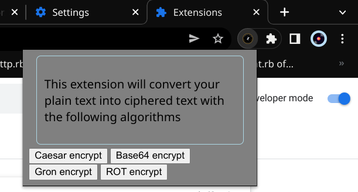

# visual-encryptor

A chrome extension that allows you to encrypt all visible text in the current webpage you are in. Currently in the development stage, we encourage all contributors to implement features in the project.  
  
# Project structure
* **popup.html** - contains the page that is displayed when the extension is clicked upon. It shows a menu of 4 buttons representing 4 encryption algorithms for ciphering the plain text. User has the choice to select any encryption technique, and the extension should replace all the plain text in the screen with encrypted text.
* **static** - contains all the static files required for the project like css and images.

# Test the project locally
* Fork the repo.
* Clone your copy of the repo to your local machine.
* Open chrome on your machine and go to settings. 
* Go to extensions. Turn on developer mode.
* Click on load unpacked. Select the `visual-encryptor` directory.
* Now go to `extensions` section in the chrome tab and click on the `visual-encryptor` extension.
* It should popup the welcome page of the project.
* Now, whatever changes are made to your project locally will reflect in your chrome extension tab.

# Roadmap of features expected
* Collect all the visible text of current webpage in the `popup.html` code.
* Collect the encryption algorithm that user wants. (Provide implementation of all encryption algorithms in the code)
* Encrypt all the text.
* Replace the visible text of the current webpage with the encrypted text.
* When the user re-clicks the algorithm, the encrypted text should be replaced back with plain text.

# Contributing
Thank you for your interest in contributing for the project. Checkout the [Contributing Guidelines](https://github.com/lugvitc/visual-encryptor/blob/master/CONTRIBUTING.md) before submitting any PR. Submit small changes in a single PR so that it is easier to review (for instance, work on one feature in one PR). 
